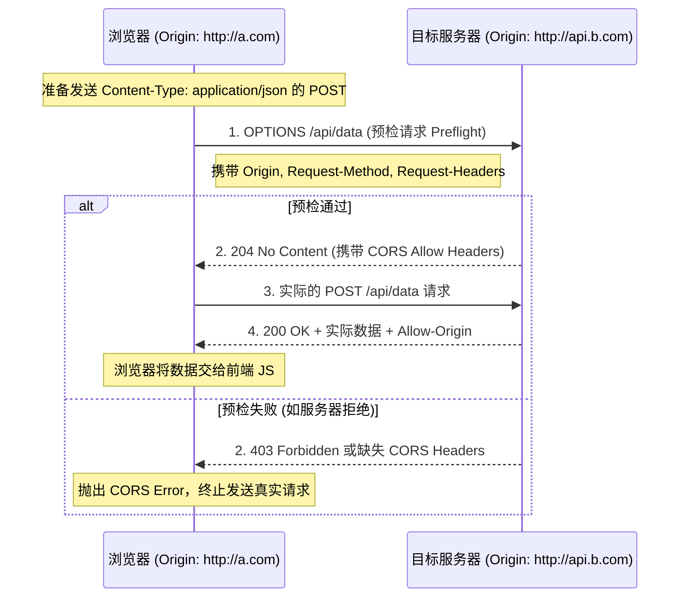

# 跨域资源共享 (CORS)

解决在 Web 浏览器的同源策略（Same-Origin Policy）限制下，如何安全地允许一个网页去请求和访问另一个不同源（不同协议、域名或端口）服务器上的受限资源的问题。

## 核心原理

- **同源策略**：浏览器默认的安全机制，阻止前端代码（如 Fetch、XHR）读取不同源的响应数据。
- **基于 HTTP 头的协商**：CORS 并不是让浏览器不发送请求，而是通过在服务器的 HTTP 响应头中添加特定的字段（如 `Access-Control-Allow-Origin`），告诉浏览器：“这个来源是被允许的”，从而让浏览器放行响应数据。
- **预检请求 (Preflight)**：对于可能对服务器数据产生副作用的复杂请求（如 PUT/DELETE 或带有自定义 Headers 的请求），浏览器会先发送一个 `OPTIONS` 方法的预检请求，确认服务器是否支持跨域，得到允许后才会发送实际的请求。

## 请求分类与触发条件

浏览器将跨域请求分为两类，以决定是否需要“提前询问”服务器（即发送 OPTIONS 请求）。

**1. 简单请求 (Simple Request)**
同时满足以下条件的请求被视为简单请求，**不会触发 OPTIONS 预检**：

- **方法**：`GET`, `HEAD`, `POST` 之一。
- **请求头**：仅包含浏览器自动设置的头，或 `Accept`, `Accept-Language`, `Content-Language`, `Content-Type`。
- **Content-Type 的值仅限**：
  - `text/plain`
  - `multipart/form-data`
  - `application/x-www-form-urlencoded`

**2. 复杂请求 (Preflighted Request)**
不满足简单请求条件的请求（例如我们常用的 `application/json`），**必须先进行 OPTIONS 预检**。常见触发条件：

- 使用了 `PUT`, `DELETE`, `PATCH` 等方法。
- 请求体格式为 `application/json`。
- 携带了自定义 Header（如 `Authorization`, `X-Custom-Header`）。

## 结构

**核心的 HTTP 响应头：**

- `Access-Control-Allow-Origin`：指定允许访问该资源的外域 URI（可以设为 `*`，但不推荐在有凭证时使用）。
- `Access-Control-Allow-Methods`：指定允许的 HTTP 请求方法（如 `GET, POST, PUT`）。
- `Access-Control-Allow-Headers`：指定允许客户端携带的自定义 HTTP 头。
- `Access-Control-Allow-Credentials`：布尔值，指定是否允许浏览器发送和接收 Cookie 等身份凭证。
- `Access-Control-Max-Age`：指定预检请求的缓存时间，减少重复发送 `OPTIONS` 请求的性能开销。

## 工作流程

**运行过程（以带有 JSON 数据和凭证的跨域 POST 请求为例）：**

1. **发起拦截**：前端代码（如 Fetch）发起请求，浏览器发现目标 URL 不同源，且 `Content-Type: application/json`，判定为复杂请求。
2. **发送预检 (OPTIONS)**：浏览器自动构造一个 `OPTIONS` 请求发送给服务器。该请求不携带数据，但包含：
   - `Origin`: 标明请求来源。
   - `Access-Control-Request-Method`: 告知服务器后续实际请求将使用的方法（如 `POST`）。
   - `Access-Control-Request-Headers`: 告知服务器实际请求将携带的自定义头。
3. **后端响应预检**：服务器接收到 `OPTIONS` 请求，根据配置（如 `@koa/cors`）决定是否放行。若允许，返回 `200` 或 `204` 状态码，并附带相关的 `Access-Control-Allow-*` 响应头。
4. **浏览器放行 (校验通过)**：浏览器接收到预检响应，核对权限。如果匹配通过，则继续后续步骤；如果失败（如 Origin 不匹配或凭证冲突），则在控制台抛出 CORS 错误，且**不会**发送真实请求。
5. **发送实际请求**：浏览器发送真正的 POST 请求到后端。
6. **响应真实数据**：后端处理请求，并再次在响应头中带上 `Access-Control-Allow-Origin`，浏览器最终将数据交给前端代码。

## 技术权衡

**关于 CORS 与 OPTIONS 预检的优缺点：**

**优点：**

- **保护服务器数据**：防止某些旧的、不支持 CORS 的服务器（它们可能未针对跨域进行防护）被恶意网页发起的非预期请求（如 `DELETE`）意外修改数据。
- **保护用户隐私**：结合凭证策略（Credentials），确保敏感数据不会被恶意网站轻易读取。
- **安全性提升**：相比于早期的 JSONP 方案，CORS 是一种更加规范和安全的现代跨域解决方案，能精确控制权限。
- **支持所有请求方法**：JSONP 仅支持 GET 请求，而 CORS 支持 RESTful 所有的请求方法（POST, PUT, DELETE 等）。

**缺点：**

- **配置较繁琐**：后端需要精确配置 Origin 和允许的 Headers，特别是在微服务和多域名的复杂架构下。
- **性能损耗**：每次复杂请求前都要多一次网络往返（RTT），增加了延迟。
- **缓解方案**：通过在服务器端设置 `Access-Control-Max-Age` 响应头，可以让浏览器在指定时间内缓存预检结果，减少后续相同请求的 OPTIONS 开销。

## 画图解释

## 关联知识

- **[浏览器安全策略](./Browser-Security.md)**：深入了解同源策略、XSS 以及 CSRF 的底层逻辑。
- **同源策略 (Same-Origin Policy)**：CORS 诞生的根本原因，Web 安全的基石。
- **JSONP**：一种古老的跨域手段，利用 `<script>` 标签不受同源策略限制的漏洞实现，现已逐渐被 CORS 淘汰。
- **Nginx 反向代理**：除了后端代码配置 CORS，也可以通过 Nginx 在代理层统一加上 CORS 响应头来实现跨域，或者将跨域请求伪装成同源请求。
