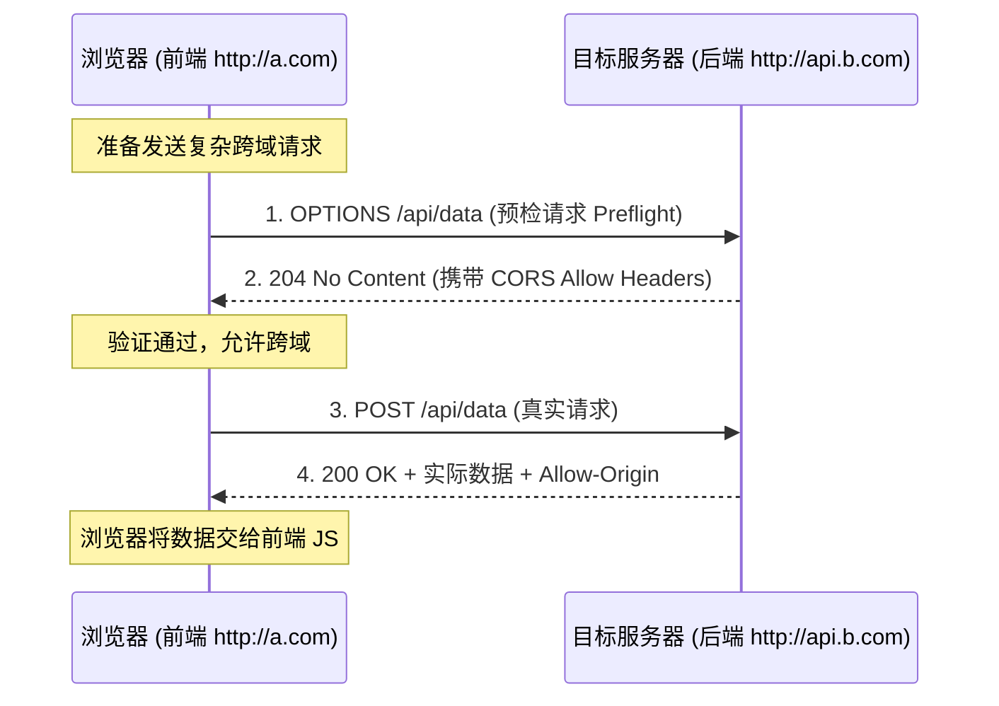

# 跨域资源共享 (CORS)

解决在 Web 浏览器的同源策略（Same-Origin Policy）限制下，如何安全地允许一个网页去请求和访问另一个不同源（不同协议、域名或端口）服务器上的受限资源的问题。

## 核心原理

- **同源策略**：浏览器默认的安全机制，阻止前端代码（如 Fetch、XHR）读取不同源的响应数据。
- **基于 HTTP 头的协商**：CORS 并不是让浏览器不发送请求，而是通过在服务器的 HTTP 响应头中添加特定的字段（如 `Access-Control-Allow-Origin`），告诉浏览器：“这个来源是被允许的”，从而让浏览器放行响应数据。
- **预检请求 (Preflight)**：对于可能对服务器数据产生副作用的复杂请求（如 PUT/DELETE 或带有自定义 Headers 的请求），浏览器会先发送一个 `OPTIONS` 方法的预检请求，确认服务器是否支持跨域，得到允许后才会发送实际的请求。

## 结构

**核心的 HTTP 响应头：**
- `Access-Control-Allow-Origin`：指定允许访问该资源的外域 URI（可以设为 `*`，但不推荐在有凭证时使用）。
- `Access-Control-Allow-Methods`：指定允许的 HTTP 请求方法（如 `GET, POST, PUT`）。
- `Access-Control-Allow-Headers`：指定允许客户端携带的自定义 HTTP 头。
- `Access-Control-Allow-Credentials`：布尔值，指定是否允许浏览器发送和接收 Cookie 等身份凭证。
- `Access-Control-Max-Age`：指定预检请求的缓存时间，减少重复发送 `OPTIONS` 请求的性能开销。

## 工作流程

**运行过程（以发送带自定义 Header 的 POST 复杂请求为例）：**

1. **触发跨域**：客户端（运行在 `http://a.com`）向后端（`http://api.b.com`）发送一个带有自定义 Header 的 POST 请求。
2. **发送预检**：浏览器拦截真实请求，自动先发送一个 `OPTIONS` 请求给后端，询问是否允许。
3. **后端响应预检**：后端接收到 `OPTIONS` 请求，根据配置（如 `@koa/cors`）返回 204/200 状态码，并带上 `Access-Control-Allow-*` 等跨域允许头。
4. **校验通过**：浏览器接收到预检响应，发现当前的源和方法都在允许范围内。
5. **发送实际请求**：浏览器发送真正的 POST 请求到后端。
6. **响应真实数据**：后端处理请求，并再次在响应头中带上 `Access-Control-Allow-Origin`，浏览器最终将数据交给前端代码。

## 技术权衡

**优点：**

- **安全性提升**：相比于早期的 JSONP 方案，CORS 是一种更加规范和安全的现代跨域解决方案，能精确控制权限。
- **支持所有请求方法**：JSONP 仅支持 GET 请求，而 CORS 支持 RESTful 所有的请求方法（POST, PUT, DELETE 等）。

**缺点：**

- **配置较繁琐**：后端需要精确配置 Origin 和允许的 Headers，特别是在微服务和多域名的复杂架构下。
- **性能开销**：预检请求（OPTIONS）增加了一次完整的网络往返（RTT），对延迟敏感的应用有一定影响（可通过设置 Max-Age 缓解）。

## 画图解释

## 关联知识

- **同源策略 (Same-Origin Policy)**：CORS 诞生的根本原因，Web 安全的基石。
- **JSONP**：一种古老的跨域手段，利用 `<script>` 标签不受同源策略限制的漏洞实现，现已逐渐被 CORS 淘汰。
- **Nginx 反向代理**：除了后端代码配置 CORS，也可以通过 Nginx 在代理层统一加上 CORS 响应头来实现跨域，或者将跨域请求伪装成同源请求。
