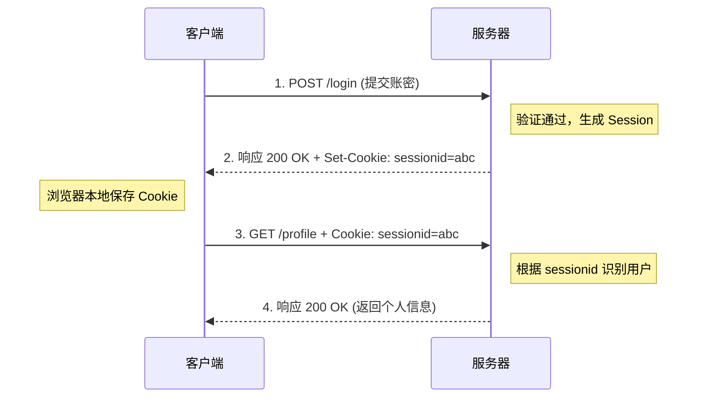

# Cookie

解决 HTTP 无状态协议下的身份识别和登录认证问题。由于 HTTP 每次请求都是独立的，服务器无法直接分辨多次请求是否来自同一个客户端，Cookie 提供了一种在客户端保存状态并在后续请求中自动携带的机制。

## 核心原理

- **服务端下发**：服务器通过 HTTP 响应头向客户端发送包含状态信息的数据。
- **客户端存储与携带**：客户端接收后保存在本地，并在后续向该服务器发起的请求中，自动将这段数据附加在 HTTP 请求头中，供服务器识别用户状态。

## 结构

- **Name/Value**：Cookie 的键值对（实际存储的数据）。
- **Domain**：Cookie 的有效域名。
- **Path**：Cookie 的有效路径。
- **Expires / Max-Age**：Cookie 的过期时间或有效时长。
- **Secure**：布尔值标记，指定是否仅在 HTTPS 安全连接下传输。
- **HttpOnly**：布尔值标记，指定是否禁止 JavaScript 访问，防范 XSS 攻击。

## 工作流程

1. **服务器设置**：服务器在处理客户端请求（如登录）后，通过 `Set-Cookie` 首部字段向客户端发送 Cookie。
2. **客户端保存**：客户端接收到 `Set-Cookie` 字段后，将其保存在本地。
3. **客户端发送**：下次请求该域名的资源时，客户端会自动将保存的 Cookie 值放入请求报文的 `Cookie` 字段中发送。
4. **服务器处理**：服务器收到 Cookie 后检查并匹配客户端的状态信息，完成身份验证或状态恢复。

## 技术权衡

**优点：**

- **简单易用**：作为 HTTP 标准的一部分，浏览器原生支持，前后端交互实现简单。
- **状态保持**：有效弥补了 HTTP 无状态的缺陷，支持持久化登录等功能。

**缺点：**

- **安全性差**：如果不设置 `HttpOnly` 和 `Secure`，容易被 XSS 窃取或面临 CSRF 攻击；明文传输容易被抓包。
- **容量受限**：单个 Cookie 大小通常限制在 4KB 左右，且每个域下的数量也有限制。
- **性能开销**：每次请求（即使是请求静态图片）都会携带该域下的所有 Cookie，造成不必要的网络带宽浪费。

## 画图解释

## 关联知识

- **Session**：Cookie 通常与服务端的 Session 配合使用。Cookie 只保存 Session ID，真正的用户状态数据存储在服务器端。
- **Token (JWT)**：另一种主流的鉴权方案。通常存储在 LocalStorage 中，通过 HTTP 的 `Authorization` 头手动传递，能更好防范 CSRF，且适合跨域和微服务架构。
- **Web Storage (LocalStorage / SessionStorage)**：HTML5 提供的客户端存储方案，容量大（5MB+），不随请求自动发送，适合存储纯客户端数据。
