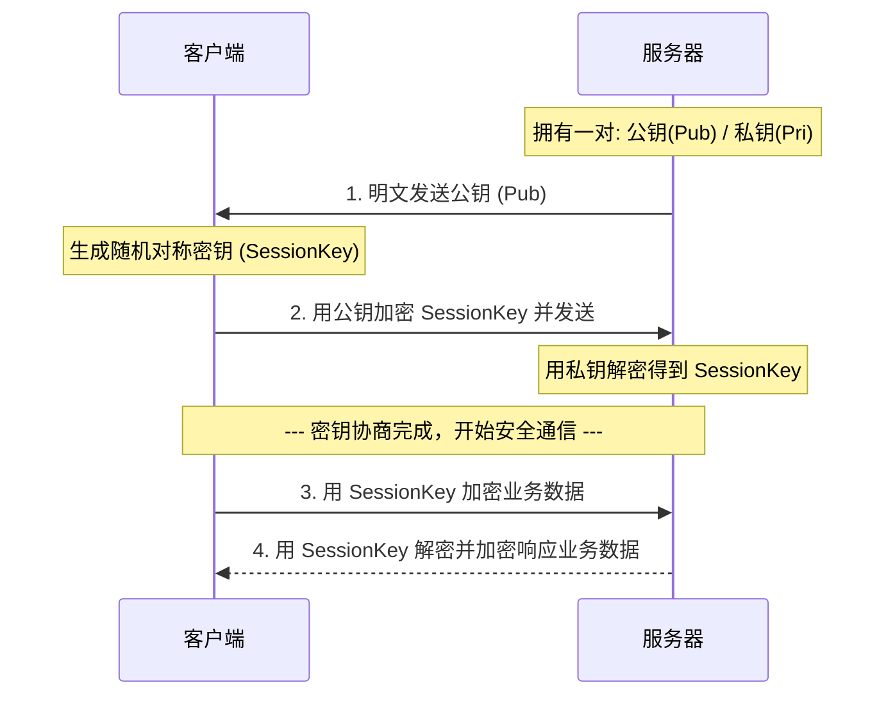

# 密码学 (Cryptography)

解决数据在不可信网络（如互联网）中传输和存储时的安全问题。主要解决四个维度的威胁：**机密性**（防窃听）、**完整性**（防篡改）、**身份认证**（防伪装）和**不可否认性**（防抵赖）。

## 核心原理

通过数学算法对数据进行转换和处理。

- **对称加密**：加密和解密使用同一把密钥，通信双方必须共享该密钥。
- **非对称加密**：使用一对数学相关的密钥（公钥和私钥）。公钥加密的数据只能用私钥解密（保密）；私钥加密（签名）的数据只能用公钥解密（认证）。
- **哈希算法（散列）**：将任意长度数据映射为固定长度的摘要，单向不可逆。

## 结构

- **对称加密算法**：AES, DES, 3DES, ChaCha20 等。
- **非对称加密算法**：RSA, ECC (椭圆曲线), DSA 等。
- **哈希算法**：MD5, SHA-1, SHA-256, SHA-512 等。
- **数字签名**：哈希算法与非对称加密的结合，发送方用私钥加密数据的哈希值，接收方用公钥解密并核对。

## 工作流程

**运行过程（以协商加密/混合加密为例）：**
单纯使用对称或非对称加密都有缺陷，现代通信（如 HTTPS）通常采用**混合加密**机制：

1. **获取公钥**：客户端获取服务器的非对称加密公钥（通常包含在数字证书中）。
2. **生成会话密钥**：客户端生成一个随机的对称加密密钥（Session Key）。
3. **安全传输密钥**：客户端使用服务器的公钥加密该 Session Key，并发送给服务器。
4. **解密获取密钥**：服务器收到后，使用自己的私钥解密，获得 Session Key。
5. **数据加密通信**：双方开始使用该 Session Key 进行对称加密的高速数据传输。

## 技术权衡

**优点与缺点：**

- **对称加密：**
  - _优点_：计算速度快，效率高，适合加密大量数据。
  - _缺点_：密钥分发困难（即“如何安全地把密钥告诉对方”是一个难题）。

- **非对称加密：**
  - _优点_：完美解决了密钥分发问题；支持数字签名，可进行身份认证。
  - _缺点_：计算极其复杂，速度极慢，不适合对长报文直接加密。

- **哈希算法：**
  - _优点_：不可逆、防篡改，极小的数据变动也会导致哈希值大变（雪崩效应）。
  - _缺点_：容易遭遇彩虹表暴力破解（通常通过“加盐 Salt”缓解），本身不解决机密性问题。

## 画图解释

## 关联知识

- **HTTPS / TLS**：密码学在网络中最广泛的应用，TLS 握手本质上就是非对称加密协商对称密钥的过程。
- **数字证书 (CA)**：为了防止黑客在非对称加密中伪造公钥（中间人攻击），引入了第三方权威机构对公钥进行数字签名背书。
- **区块链 / 加密货币**：大量使用哈希链（SHA-256）保证账本不可篡改，使用非对称加密（ECC）证明账户所有权。
