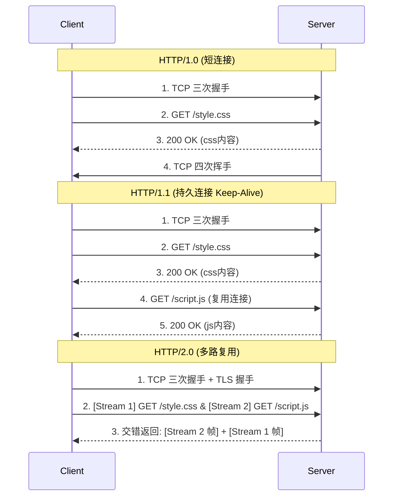

# HTTP 版本演进与差异

随着互联网和 Web 应用的飞速发展，早期的 HTTP 协议无法满足现代网页对传输效率、多媒体支持、连接管理以及安全性的需求。HTTP 的版本演进本质上是为了**提高网络传输性能、降低延迟、增强语义表达能力**，从而适应从简单文本文档到复杂交互式 Web 应用的变迁。

## 核心原理

- **HTTP/0.9**：最简单的单行请求，仅用于传输纯文本。
- **HTTP/1.0**：引入了协议版本号、状态码、HTTP Header 和多媒体支持。
- **HTTP/1.1**：现代 Web 的基石，引入了持久连接（Keep-Alive）、管道化、缓存控制、分块传输和 Host 头。
- **HTTP/2.0**：解决队头阻塞问题，引入二进制分帧、多路复用、头部压缩和服务器推送。
- **HTTP/3.0**：彻底放弃底层 TCP，基于 UDP 的 QUIC 协议，解决 TCP 队头阻塞和握手延迟问题。

## 结构与演进

### 1. HTTP/0.9 (1991年)

- **极简设计**：只支持 `GET` 方法。
- **无请求头/响应头**：请求只有一行 `GET /index.html`。
- **纯文本**：响应只包含 HTML 纯文本，没有状态码。
- **短连接**：服务器发送完 HTML 内容后立刻关闭 TCP 连接。

### 2. HTTP/1.0 (1996年)

- **多方法支持**：新增了 `POST` 和 `HEAD` 方法。
- **引入 Header**：请求和响应都加入了 Header（头部字段），极大增强了扩展性。
- **状态码**：引入了状态码（如 200, 404）来表示请求结果。
- **多类型支持**：通过 `Content-Type` 支持了图片、视频等非文本格式的传输。
- **短连接为主**：默认仍然是短连接（每次请求都需要三次握手），但可以通过非标准的 `Connection: keep-alive` 尝试保持连接。

### 3. HTTP/1.1 (1997年)

_目前互联网上最广泛使用的版本之一。_

- **持久连接 (Persistent Connection)**：默认开启 `Connection: keep-alive`，多个 HTTP 请求可以复用同一个 TCP 连接，显著降低延迟。
- **管道化 (Pipelining)**：允许客户端在不等待上一个响应的情况下连续发送多个请求。
  - _局限性（应用层队头阻塞）_：服务器必须严格按照接收请求的顺序返回响应。如果第一个请求的处理极其耗时（例如查询复杂数据库），即使后面的请求处理已经完成，也必须排队等待第一个响应发送完毕后才能发送。这导致了所谓的“应用层队头阻塞（Head-of-Line Blocking, HOLB）”。由于该问题难以完美解决，现代浏览器实际上大多默认关闭了管道化功能。
- **新增 Host 头**：请求必须携带 `Host` 头，使得一台物理服务器（同一个 IP）可以部署多个不同域名的 Web 站点（虚拟主机）。
- **分块传输 (Chunked Transfer)**：支持动态生成的内容通过 `Transfer-Encoding: chunked` 分块发送，无需预先知道 `Content-Length`。
- **完善缓存与断点续传**：引入了 `Cache-Control`、`ETag` 等更强大的缓存机制；引入了 `Range` 请求支持断点续传。
- **更多方法**：新增 `PUT`, `DELETE`, `OPTIONS`, `PATCH` 等方法，奠定了 RESTful API 的基础。

### 4. 现状与未来 (HTTP/2 & HTTP/3)

- **HTTP/2 (2015年)**：
  - **二进制分帧**：数据在传输层被切分为更小的二进制帧，而非明文。
  - **多路复用 (Multiplexing)**：在一个 TCP 连接中并发交错地发送多个请求和响应，彻底解决了应用层队头阻塞。
  - **头部压缩 (HPACK)**：压缩 HTTP 头部，减少传输开销。
  - **服务端推送 (Server Push)**：服务器可以主动向客户端推送资源。
- **HTTP/3 (2022年)**：
  - **基于 QUIC (UDP)**：抛弃了 TCP，使用基于 UDP 的 QUIC 协议。
  - **解决 TCP 队头阻塞**：在丢包时，只影响丢失包对应的流，其他流的传输不受影响。
  - **0-RTT 握手**：极大降低了连接建立的延迟。

## 工作流程对比

**HTTP/1.0 vs HTTP/1.1 连接管理：**

- **HTTP/1.0**：
  TCP 握手 -> 发送请求 1 -> 接收响应 1 -> TCP 挥手。
  TCP 握手 -> 发送请求 2 -> 接收响应 2 -> TCP 挥手。
- **HTTP/1.1 (Keep-Alive)**：
  TCP 握手 -> 发送请求 1 -> 接收响应 1 -> 发送请求 2 -> 接收响应 2 -> (闲置超时后) TCP 挥手。

## 技术权衡

**各版本核心痛点及解决策略：**

- **1.0 的痛点**：连接无法复用导致频繁的三次握手（延迟高）。**（1.1 用 Keep-Alive 解决）**
- **1.1 的痛点**：应用层队头阻塞（前一个响应慢会卡住后面的响应），文本解析效率低。**（2.0 用多路复用和二进制分帧解决）**
- **2.0 的痛点**：TCP 层的队头阻塞（TCP 是按序传输的，一个数据包丢失会导致整个 TCP 连接阻塞等待重传）。**（3.0 用基于 UDP 的 QUIC 解决）**

## 画图解释

## 关联知识

**与其他技术的联系：**

- **TCP/UDP**：HTTP 0.9 ~ 2.0 均强依赖 TCP 协议；HTTP/3 转向 UDP。
- **RESTful API**：其设计理念（资源导向、语义化 Method）高度依赖 HTTP/1.1 引入的多种方法和状态码。
- **TLS/SSL**：现代浏览器要求 HTTP/2 必须在 HTTPS 下运行，HTTP/3 的 QUIC 则原生内置了 TLS 1.3 加密。
