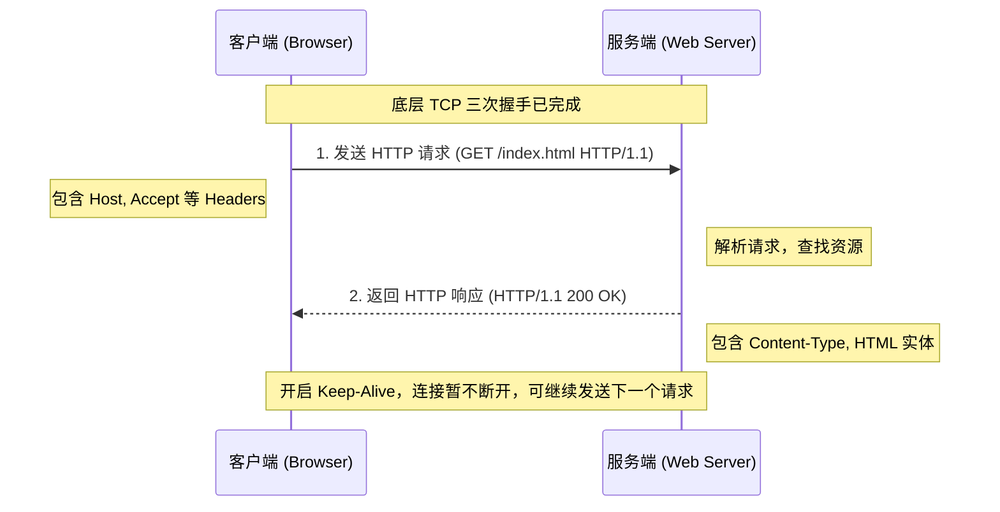

# HTTP

HTTP (Hypertext Transfer Protocol) 是用于传输超文本（如 HTML 文档、图片、JSON 数据等）的应用层协议。它定义了万维网（WWW）中客户端（浏览器）与服务端之间请求和响应的标准化通信方式。

## 核心原理

- **请求-响应模型**：客户端主动发起请求，服务端被动接收并返回响应。
- **无状态协议 (Stateless)**：HTTP 协议本身不维护前后请求的状态，每个请求都是完全独立的。
- **资源寻址与动作**：通过 URI 定位网络资源，通过 HTTP Method（GET, POST, PUT, DELETE 等）定义对资源的操作。

## 结构

**组成部分：**

- **Request (请求报文)**：
  - **请求行**：请求方法、请求 URI、协议版本。
  - **请求首部 (Headers)**：如 `Accept`, `Host`, `User-Agent`, `Authorization` 等。
  - **实体主体 (Body)**：POST/PUT 携带的数据。
- **Response (响应报文)**：
  - **状态行**：协议版本、状态码 (如 200, 404, 500)、原因短语。
  - **响应首部 (Headers)**：如 `Content-Type`, `Content-Length`, `Set-Cookie`, `Cache-Control` 等。
  - **实体主体 (Body)**：返回的资源内容。
- **状态码分类**：
  - `1xx`：信息性状态码（处理中）
  - `2xx`：成功（如 `200 OK`, `204 No Content`）
  - `3xx`：重定向（如 `301 Moved Permanently`, `304 Not Modified`）
  - `4xx`：客户端错误（如 `400 Bad Request`, `401 Unauthorized`, `404 Not Found`）
  - `5xx`：服务端错误（如 `500 Internal Server Error`, `503 Service Unavailable`）

## 工作流程

**运行过程：**

1. **建立连接**：客户端通过 DNS 解析目标域名，与服务端在传输层（TCP）建立连接。
2. **发送请求**：客户端构建 HTTP 请求报文并发送。
3. **处理请求**：服务器解析报文，根据 URI 和方法执行后台逻辑（如读取文件、查询数据库）。
4. **返回响应**：服务器构建 HTTP 响应报文，将处理结果和数据返回给客户端。
5. **连接管理**：在 HTTP/1.1 中默认使用**持久连接 (Keep-Alive)**，TCP 连接保持打开状态以复用；若明确关闭，则断开 TCP 连接。

## 技术权衡

**优点：**

- **简单灵活**：报文格式清晰易读，不仅能传文本，还能通过多部分对象集合 (Multipart) 传图片、视频等二进制数据。
- **无状态的优势**：减少了服务器的 CPU 和内存资源消耗，易于横向扩展（集群部署）。
- **丰富的扩展性**：支持 Range Request (断点续传)、Content Negotiation (内容协商)、压缩 (gzip) 和分块传输编码等特性。

**缺点（Defect）：**

- **明文通信**：数据不加密，极易被中间人窃听。
- **不验证身份**：无法确认通信方的真实身份，容易遭遇伪装。
- **无完整性校验**：无法证明报文在传输过程中未被篡改。
- **无状态的劣势**：某些场景（如电商购物车）必须依赖额外机制（如 Cookie）来维持状态，增加了请求的冗余数据。

## 画图解释

## 关联知识

**与其他技术的联系：**

- **HTTPS**：在 HTTP 之下加入了 SSL/TLS 层，弥补了 HTTP 不加密、不验证、无完整性校验的三大缺陷。
- **TCP/IP**：HTTP 是基于 TCP/IP 协议栈的应用层协议，依赖 TCP 提供可靠的数据传输。
- **WebSocket**：弥补 HTTP 只能“客户端单向发起请求”的缺陷，建立在 HTTP 之上的全双工双向通信协议。
- **RESTful API**：一种基于 HTTP 协议设计软件架构的风格，充分利用 HTTP 方法和状态码。
