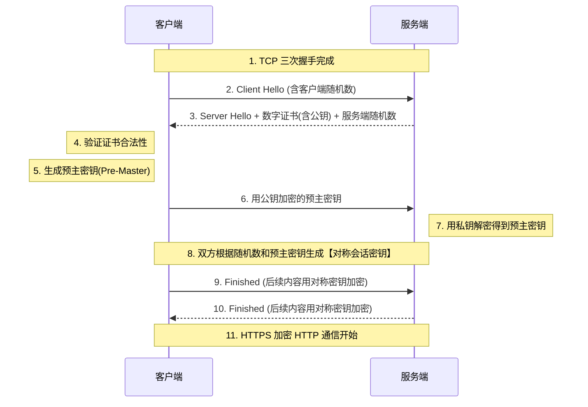

# HTTPS

解决 HTTP 明文传输所带来的三大安全问题：**窃听风险**（数据被看光）、**篡改风险**（数据被修改）和**伪装风险**（通信方身份造假）。HTTPS 确保了数据在互联网上从客户端到服务端的传输是绝对安全和可信的。

## 核心原理

HTTPS 并不是一个全新的协议，而是 **HTTP + SSL/TLS**。

- 通信接口部分用 SSL (Secure Socket Layer) 和 TLS (Transport Layer Security) 协议代替。
- HTTP 不再直接和 TCP 通信，而是先和 SSL/TLS 通信，由 SSL/TLS 再和 TCP 通信。
- 结合了**对称加密**（保障传输效率）、**非对称加密**（保障密钥安全交换）和**数字证书**（保障身份真实性）。

## 结构

**组成部分：**

- **SSL/TLS 层**：位于应用层（HTTP）和传输层（TCP）之间的安全层。
- **数字证书**：由受信任的证书颁发机构 (CA) 签发。
  - **公开密钥证书**：证明服务端公钥合法性的证书。
  - **客户端证书**：用于服务端验证客户端身份（如网银场景）。
  - **自签名证书**：自己生成的证书（通常不受浏览器信任）。
- **加密套件**：包含了握手过程所需的非对称加密算法、对称加密算法和哈希算法的组合。

## 工作流程

**运行过程（TLS 握手简述）：**

1. **Client Hello**：客户端发起请求，提供支持的 TLS 版本、加密套件列表和客户端随机数。
2. **Server Hello & 证书下发**：服务端响应，选择加密套件，发送服务端随机数，并下发数字证书（包含公钥）。
3. **验证证书**：客户端通过内置的 CA 根证书验证服务端数字证书的合法性，确保没被伪造。
4. **密钥协商**：客户端生成一个“预主密钥 (Pre-Master Secret)”，用服务端的公钥加密后发送给服务端。服务端用私钥解密。
5. **生成会话密钥**：双方利用之前的客户端随机数、服务端随机数和预主密钥，计算出完全相同的“对称会话密钥”。
6. **加密通信**：握手结束，双方使用该对称密钥对 HTTP 报文进行加密传输。

## 技术权衡

**优点：**

- **安全性极高**：提供机密性、完整性保护，并验证服务器身份，防范中间人攻击、数据劫持（如运营商插广告）。
- **SEO 友好**：主流搜索引擎（如 Google, 百度）会优先收录和提升 HTTPS 网站的排名。

**缺点：**

- **性能损耗**：TLS 握手需要额外的网络往返（RTT），且非对称加解密过程消耗较多 CPU 资源。
- **成本增加**：购买受信任的 CA 证书通常需要一定费用，且证书有有效期，需要持续维护和更新。

## 画图解释

## 关联知识

**与其他技术的联系：**

- **HTTP**：HTTPS 的底层业务承载协议，所有 HTTP 的语法和语义在 HTTPS 中完全保留，只是被加密包裹。
- **Cryptography (密码学)**：HTTPS 是现代密码学的集大成者，综合运用了 RSA/ECC（非对称）、AES（对称）和 SHA（哈希）。
- **TCP/IP**：TLS 建立在 TCP 提供的数据流基础之上。
