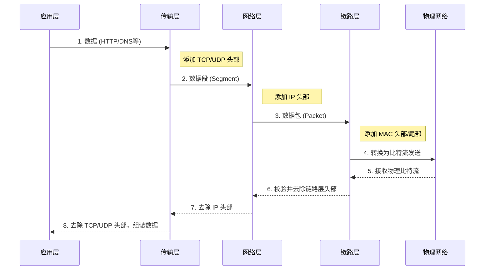
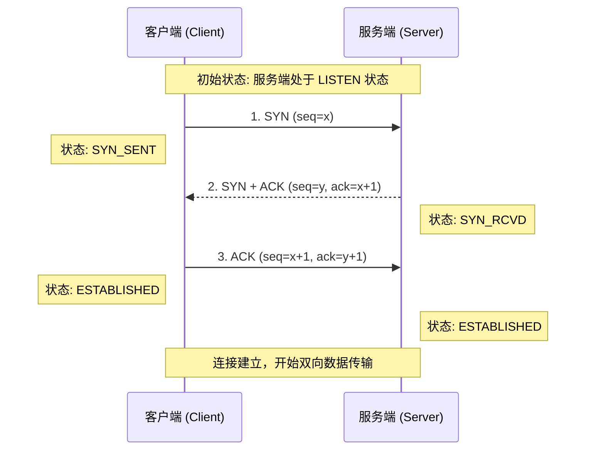
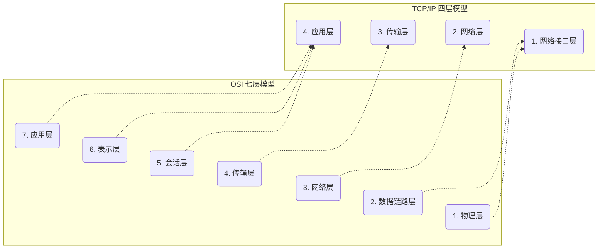

# TCP/IP协议

TCP/IP（Transmission Control Protocol/Internet Protocol）协议族主要解决计算机网络中不同设备之间如何相互发现、建立连接并进行可靠或不可靠数据传输的问题。它屏蔽了底层物理网络的硬件差异，使得全球范围内的不同计算机、不同操作系统能够通过互联网进行标准化的通信。

## 核心原理

- **分层解耦**：将复杂的网络通信过程划分为多个相对独立的层次，每层只负责特定的功能，并向上层提供服务、向下层调用服务。
- **协议栈**：以 IP 协议（负责无连接的寻址和路由）和 TCP 协议（负责面向连接的可靠传输）为核心，配合其他辅助协议（如 ARP, DNS 等）协同工作。
- **封装与解封装**：发送端数据在逐层向下传递时附加各层的头部信息（封装），接收端在逐层向上传递时剥离头部信息（解封装）。

## 结构

**组成部分（四层模型）：**

- **应用层**：直接与用户交互，提供具体的应用服务。常见协议：HTTP, FTP, DNS 等。
- **传输层**：处理端到端的数据传输与可靠性。常见协议：TCP（可靠、面向连接）、UDP（不可靠、无连接）。
- **网络层**：负责数据包的逻辑寻址、路由选择和转发。常见协议：IP, ARP（地址解析）, ICMP（控制报文）。
- **链路层（网络接口层）**：处理网络硬件通信，负责将数据帧发送到物理介质。涉及 MAC 地址等。

## 工作流程

以浏览器请求网页为例（综合流程）：

1. **DNS解析**：应用层将输入的域名解析为目标机器的 IP 地址。
2. **请求生成**：应用层生成 HTTP 请求报文。
3. **数据封装（发送端，自顶向下）**：
   - **传输层**：将 HTTP 报文切分为数据段，添加 TCP 首部（包括源/目的端口等）。通过三次握手建立连接。
   - **网络层**：添加 IP 首部（包括源/目的 IP 地址），根据路由表决定下一跳。
   - **链路层**：通过 ARP 获取下一跳 MAC 地址，添加以太网帧头，转为比特流发送至物理网络。
4. **网络传输**：数据包经过多个路由器进行转发，直到抵达目标设备。
5. **数据解封装（接收端，自底向上）**：
   - **链路层**：接收帧，校验并去除链路层帧头。
   - **网络层**：提取 IP 数据包，去除 IP 首部，检查路由和目标 IP。
   - **传输层**：重新组装 TCP 数据段，去除传输层首部，进行确认（ACK）。
   - **应用层**：处理最终的 HTTP 请求数据。

## 技术权衡

**优点：**

- **标准化与通用性**：全球互联网的基础，兼容几乎所有的操作系统和硬件。
- **高可靠性**：TCP 提供重传、流量控制和拥塞控制机制，保证数据准确送达。
- **可扩展性强**：分层架构使得各层可以独立演进（如 IPv4 升级为 IPv6，底层由以太网换为 Wi-Fi，均不影响应用层）。

**缺点：**

- **开销较大**：层层封装导致头部信息较多，特别是对于极小数据传输时效率较低。
- **复杂性高**：连接管理（如 TCP 的三次握手、四次挥手）和状态维护需要消耗较多系统资源。
- **安全隐患**：早期设计未充分考虑安全问题（如明文传输、IP 欺骗、ARP 欺骗等），需依赖应用层（HTTPS）或网络层（IPsec）的附加安全协议。

## 画图解释

### 1. 数据封装与解封装流程

_(注：上图展示了数据在发送端封装与接收端解封装的简化流程)_

### 2. TCP 三次握手图解

### 3. 四层模型与七层模型对比

## 关联知识

- **OSI 七层模型**：TCP/IP 是事实上的标准（四层），OSI 是理论标准（七层：物理层、数据链路层、网络层、传输层、会话层、表示层、应用层）。
- **HTTP/HTTPS**：构建在 TCP/IP 之上的应用层协议，HTTPS 还在 TCP 和 HTTP 之间加入了 TLS/SSL 层以弥补 TCP/IP 安全性的不足。
- **WebSocket**：建立在 TCP 之上，为了解决 HTTP 协议中服务器无法主动推送数据的问题而设计的全双工通信协议。
- **UDP**：与 TCP 同属传输层，牺牲了可靠性换取了低延迟，常用于音视频流媒体传输（如 WebRTC）。
