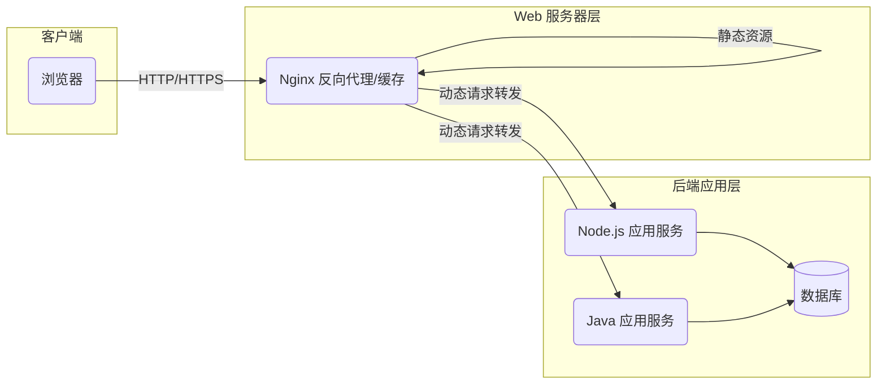

# Web 服务器 (Web Server)

解决如何接收 HTTP 请求、调度处理逻辑、并将静态或动态资源可靠地返回给客户端的问题。同时，它也解决了一台或多台物理机上管理、转发、缓存和保障不同域名 Web 站点安全的基础设施问题。

## 核心原理

- **网络监听**：持续监听特定端口（如 80 或 443）的 TCP 连接。
- **协议解析**：解析 HTTP 请求报文，根据 URL 路径、Host 等信息决定如何处理。
- **请求调度与解耦**：通过虚拟主机、代理、网关等机制，将复杂的业务逻辑从单一节点中解耦，分发到不同的内部服务。

## 结构

- **虚拟主机 (Virtual Host)**：允许一台 HTTP 服务器通过不同的 Host 头部，划分并托管多个不同的域名站点。
- **代理 (Proxy)**：接收并转发客户端/服务端消息，常追加 `Via` 首部。
  - **正向代理**：代理客户端（如代理上网）。
  - **反向代理**：代理服务端，常用于负载均衡、缓存。
- **网关 (Gateway)**：接收请求并转发给非 HTTP 协议的服务（如数据库、CGI 脚本）。
- **隧道 (Tunnel)**：建立一条客户端与服务端间的透明通信线路，常用于 SSL 加密。
- **缓存 (Cache)**：在代理或客户端本地保存资源副本，减少源服务器压力。

## 工作流程

**运行过程（以反向代理服务器为例）：**

1. **接收请求**：Web 服务器接收到外部的 HTTP 请求。
2. **缓存判断**：检查请求的资源是否在缓存中且未过期，若命中则直接返回。
3. **路由分发**：若未命中缓存，服务器根据虚拟主机配置和路由规则，决定将请求交给哪个本地文件目录或转发给哪个后端应用服务器（网关）。
4. **后端处理**：后端服务（如 PHP, Java, Node.js）处理业务逻辑，生成响应报文返回给 Web 服务器。
5. **返回与记录**：Web 服务器将最终响应返回给客户端，并记录访问日志。

## 技术权衡

**优点：**

- **高性能与并发**：专门针对静态资源和网络 IO 优化（如 Nginx 的事件驱动模型），性能极高。
- **高可用与扩展性**：通过反向代理和负载均衡，将流量分发给多台应用服务器，防止单点故障。
- **安全与控制**：可以集中配置 SSL 证书、限制访问 IP、隐藏真实后端网络架构。

**缺点：**

- **增加链路节点**：代理层级增多会导致微小的网络延迟。
- **配置复杂度**：配置虚拟主机、缓存失效策略、HTTPS 证书等需要专业的运维知识。
- **缓存一致性问题**：若缓存策略配置不当，客户端可能获取到过期的脏数据。

## 画图解释

## 关联知识

- **HTTP/HTTPS**：Web 服务器处理的核心协议。
- **DNS**：与虚拟主机紧密相关，多个域名解析到同一个 Web 服务器 IP，由 Web 服务器根据 Host 区分。
- **Nginx / Apache / IIS**：业界最著名的几种 Web 服务器软件实现。
- **负载均衡 (Load Balancing)**：反向代理服务器最核心的高级功能之一。
