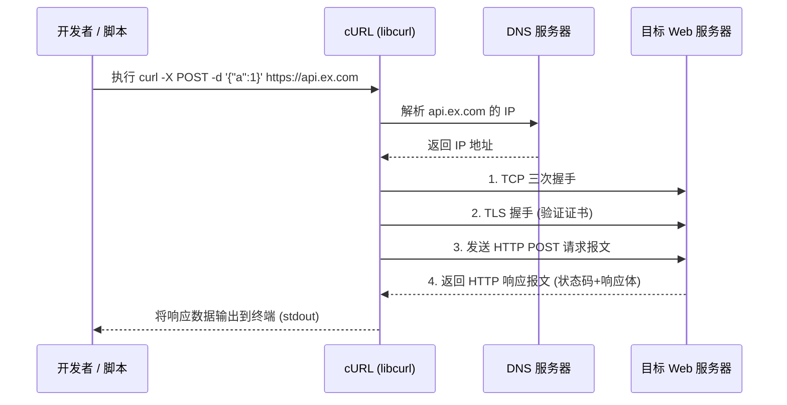

# cURL (Client URL)

解决如何在命令行（CLI）或脚本中，通过各种网络协议（如 HTTP、HTTPS、FTP 等）实现与服务器进行数据传输和交互的问题。它为开发者提供了一个通用、跨平台、无 UI 的轻量级网络请求工具。

## 核心原理

- **多协议支持**：底层基于 `libcurl` 库，支持超过 30 种网络协议，处理底层的网络传输细节。
- **无状态执行**：默认情况下每次命令执行都是独立的，除非通过参数显式指定保存和发送 Cookie 或其他状态信息。
- **直接套接字通信**：直接解析 URL 并与目标服务器建立 TCP/UDP 连接，完成网络握手和数据交换。

## 结构

- **cURL 命令行工具**：提供给用户在终端中使用的直接命令（例如 `curl [options] [URL]`）。
- **libcurl 库**：cURL 的核心网络引擎，提供了易于调用的 API，被广泛集成到各种编程语言（如 PHP, Python, C++）中。
- **常用参数/选项 (Options)**：
  - `-X`：指定 HTTP 请求方法（如 GET, POST, PUT, DELETE）。
  - `-H`：自定义附加的 HTTP 请求头。
  - `-d`：携带请求体数据（通常用于 POST 请求）。
  - `-I`：仅获取响应头信息（实际上是发起 HEAD 请求）。
  - `-v`：Verbose 模式，输出详细的通信过程（包含 DNS 解析、握手、完整的请求和响应头）。

## 工作流程

**运行过程（以发起一次 HTTPS POST 请求为例）：**

1. **解析命令**：解析用户输入的 URL 以及配置的请求头 `-H` 和请求体 `-d` 等参数。
2. **DNS 解析**：将目标域名解析为实际的 IP 地址。
3. **建立连接**：与目标服务器的指定端口（HTTPS 默认为 443）进行 TCP 三次握手。
4. **安全协商**：针对 HTTPS 请求，进行 TLS 握手，验证服务器的 SSL/TLS 证书。
5. **发送请求**：构造并发送完整的 HTTP 请求报文（包含 Request Line、Headers、Body）。
6. **接收响应**：接收服务器返回的 HTTP 响应报文，将响应体数据输出到终端或保存到文件，随后关闭或保持连接。

## 技术权衡

**优点：**

- **极致的跨平台性**：几乎预装在所有的 Linux、macOS 甚至是 Windows 10+ 操作系统中，随处可用。
- **强大的功能支持**：支持几乎所有 Web 开发中需要的请求特性（断点续传、代理代理、身份验证等）。
- **极佳的可编程性**：非常适合集成在 Shell 脚本、CI/CD 流水线中进行自动化网络接口测试和数据抓取。

**缺点：**

- **学习曲线较陡**：由于参数繁多，记忆和拼写复杂的命令行选项存在一定的学习门槛。
- **不适合复杂交互**：对于需要执行 JavaScript、渲染 DOM 或处理复杂多步用户登录流程的场景，不如无头浏览器（如 Puppeteer）或图形化工具（如 Postman）直观和方便。

## 画图解释

## 关联知识

- **HTTP/HTTPS**：cURL 最常用于交互、调试和测试的核心应用层协议。
- **Postman / Insomnia**：图形化的 API 调试工具，在可视化场景下常被视为 cURL 的替代品。
- **RESTful API**：在开发和测试基于 HTTP 的 RESTful 接口时，cURL 是最轻量级的即时验证工具。
